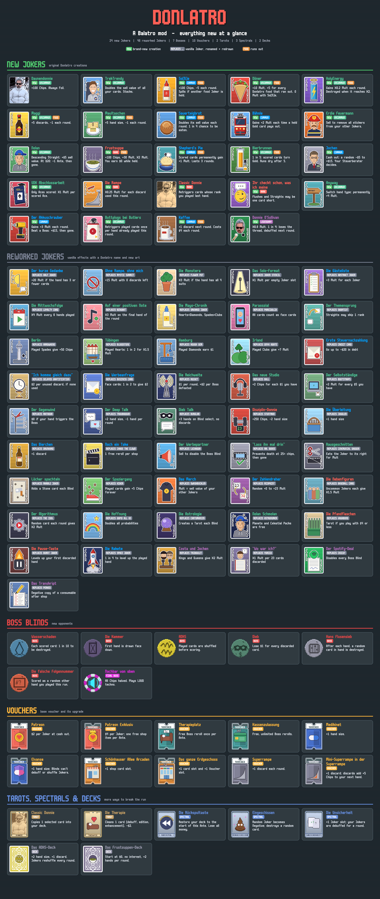

# Donlatro

A [Balatro](https://www.playbalatro.com/) mod by MichaelP: 24 new Jokers, 46 reworked vanilla Jokers,
7 Boss Blinds, 10 Vouchers, 2 Tarots, 3 Spectrals and 2 Decks.

## Installation

Download from the [latest release](https://github.com/michapachali-glitch/Donlatro/releases/latest):

- **`Donlatro-1.0.0-EasyInstall-Windows.zip`** - everything included (Lovely + Steamodded + Donlatro).
  Copy two things and play; step-by-step instructions (English + Deutsch) are in `INSTALL.txt`.
- **`Donlatro-1.0.0.zip`** - just the mod, if you already have Lovely (>= 0.9.0) and
  [Steamodded](https://github.com/Steamodded/smods): put the `Donlatro` folder into `%AppData%\Balatro\Mods\`.

## Test mode

`src/testing.lua` has `TEST_MODE = true`: only Donlatro Jokers spawn and Jokers show up twice
as often in the shop. Set it to `false` for the normal Joker pool.

## Layout

| Path | Contents |
|---|---|
| `src/jokers.lua`, `src/food.lua` | new Jokers (food Jokers run out) |
| `src/reskins.lua` | renamed + redrawn vanilla Jokers |
| `src/blinds.lua` | Boss Blinds (incl. the techno final boss) |
| `src/vouchers.lua`, `src/consumables.lua`, `src/decks.lua` | Vouchers, Tarots/Spectrals, Decks |
| `src/tracking.lua` | run-wide bookkeeping (hand history, Ante deck snapshot, ...) |
| `localization/en-us.lua` | all names and descriptions |
| `tools/` | Python scripts that generate the pixel art, the boss music and the poster |
